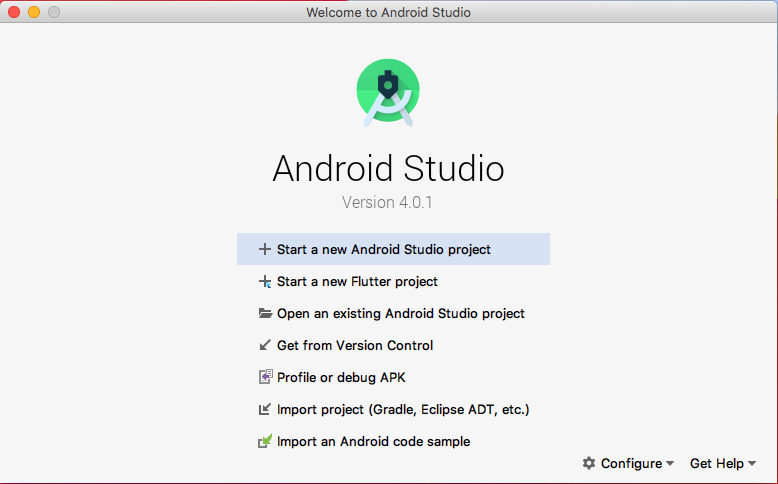
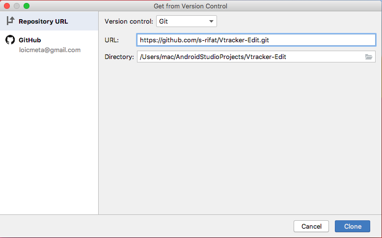
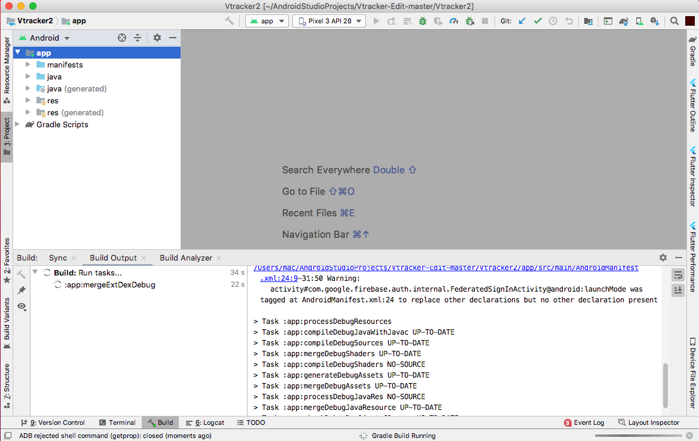
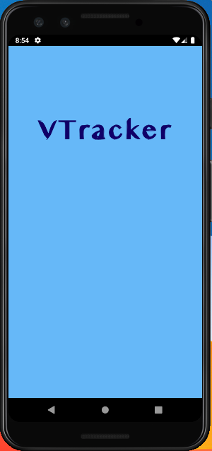

<!--Heading -->

# Installation Guide for **VTracker**

This document gives the instructions to install and run **VTracker** android application for all systems (Smartphone, Tablet and Android Studio IDE) . 

Hosted :octocat:

 

:large_blue_circle: Smartphone 
---
---

### *Prerequisites*
* Operating System : Android :heavy_check_mark:
* Operating System Version : Lollipop(v5.0) or Higer. 

### _Procedure_
---
1. Download from [Amazon AppStore](https://www.google.com) :link: [will publish soon]
1. Install
1. Run

_alternate download_ : [Google Drive Link](https://drive.google.com/file/d/1mxz1u5k18uqeq60WQMtYZmzSilwNix7-/view?usp=sharing)

 

:large_blue_circle:  Tablet 
---
---

### *Prerequisites*
* Operating System : Android :heavy_check_mark:
* Operating System Version : Lollipop(v5.0) or Higer. 

### _Procedure_
---
1. Download from [Amazon AppStore](https://www.google.com) :link:  [will publish soon]
1. Install
1. Run

_alternate download_ : [Google Drive Link](https://drive.google.com/file/d/1mxz1u5k18uqeq60WQMtYZmzSilwNix7-/view?usp=sharing)

 

:large_blue_circle: Android Studio 
---
---

### *Prerequisites*
---
* Install Android Studio : [Tutorial](https://developer.android.com/studio/install)
 
* Install Android Emulator : [Tutorial](https://developer.android.com/studio/run/emulator)
 
* Install Git and Setup for Android Studio : [Tutorial](https://stackoverflow.com/questions/37093723/how-to-add-an-android-studio-project-to-github)
 

### _Procedure_
---

:one: &nbsp; &nbsp; **Open Android Studio and Click " Get from Version Control "**

 

:two: &nbsp; &nbsp; **Copy the project repository** 

> https://github.com/s-rifat/Vtracker-User.git

 

:three: &nbsp; &nbsp; **Paste it URL section and hit Clone**

 

:four: &nbsp; &nbsp; **Project will build automatically and sync dependencies.**

 

:five: &nbsp; &nbsp; **Run project on Emulator**

  

